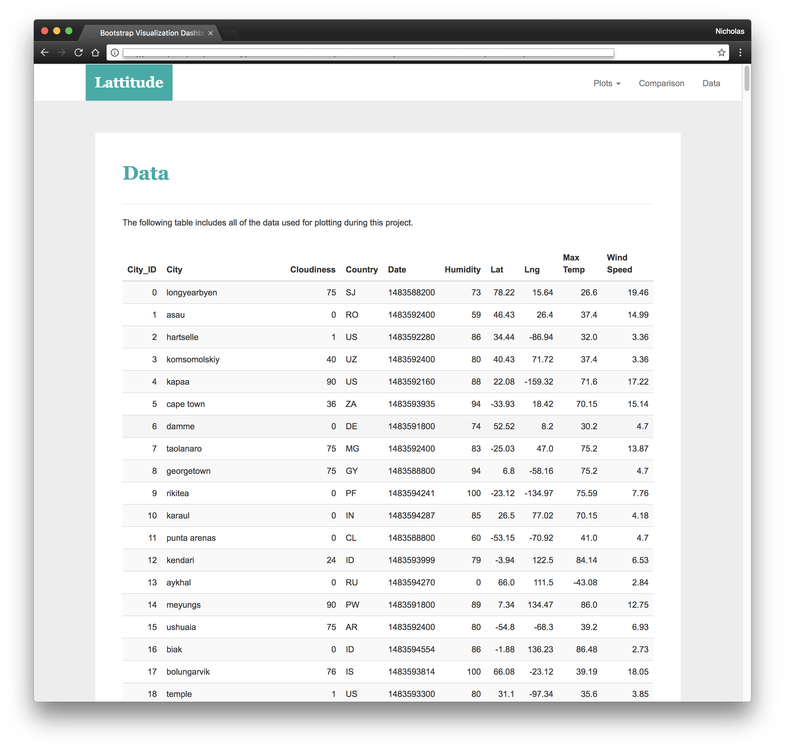

# Web-Visualization-Dashboard

## Background

Create a Visualization Dashboard Website of Weather in 500+ World Cities Relative to the Equator at Different Latitudes Using HTML5, CSS and Bootstrap

## Objectives

In building this dashboard, I will create individual pages for each plot and a means by which we can navigate between them. These pages will contain the visualizations and their corresponding explanations. We'll also have a landing page, a page where we can see a comparison of all of the plots, and another page where we can view the data used to build them.

## Website Requirements 
<u> A landing page containing: </u>
  - An explanation of the project
  - Links to each visualizations page  

  
<u> Four visualization pages, each with: </u>
  - A descriptive title and heading tag
  - The plot/visualization itself for the selected comparison
  - A paragraph describing the plot and its significance  
  

  
<u> A “Comparisons” page that:</u>
  - Contains all of the visualizations on the same page so we can easily visually compare them
  - Uses a bootstrap grid for the visualizations
  - The grid must be two visualizations across on screens medium and larger, and 1 across on extra-small and small screens  
  

<u> A “Data” page that: </u>
  - Displays a responsive table containing the data used in the visualizations
  - The table must be a bootstrap table component
  - The data must come from exporting the .csv file as HTML, or converting it to HTML  
  

The website must, at the top of every page, have a navigation menu that:
- Has the name of the site on the left of the nav which allows users to return to the landing page from any page
- Contains a dropdown on the right of the navbar named “Plots” which provides links to each individual visualization page
- Provides two more links on the right: “Comparisons” which links to the comparisons page, and “Data” which links to the data page
- Is responsive (using media queries). The nav must have similar behavior as the screenshots “Navigation Menu” section (notice the background color change)
